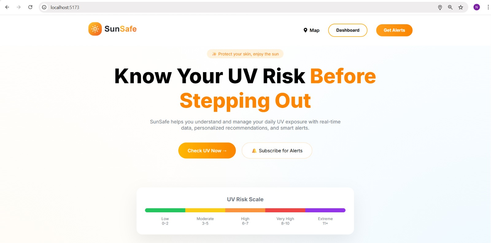
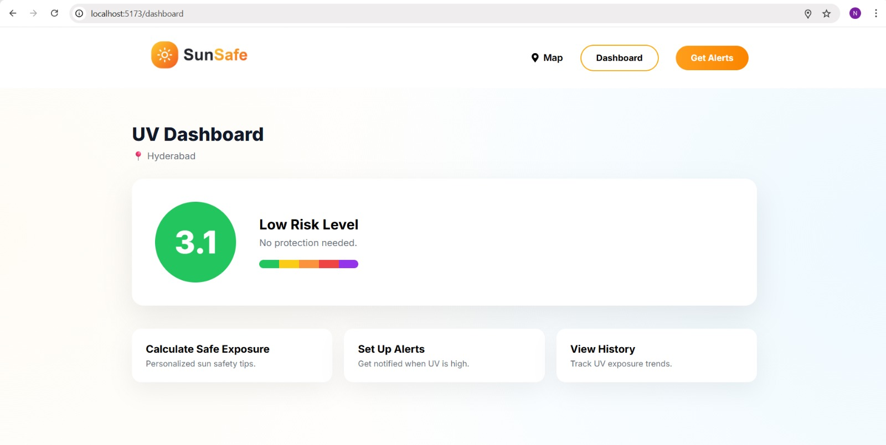
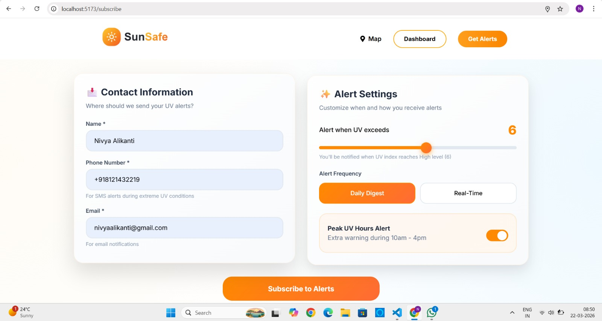
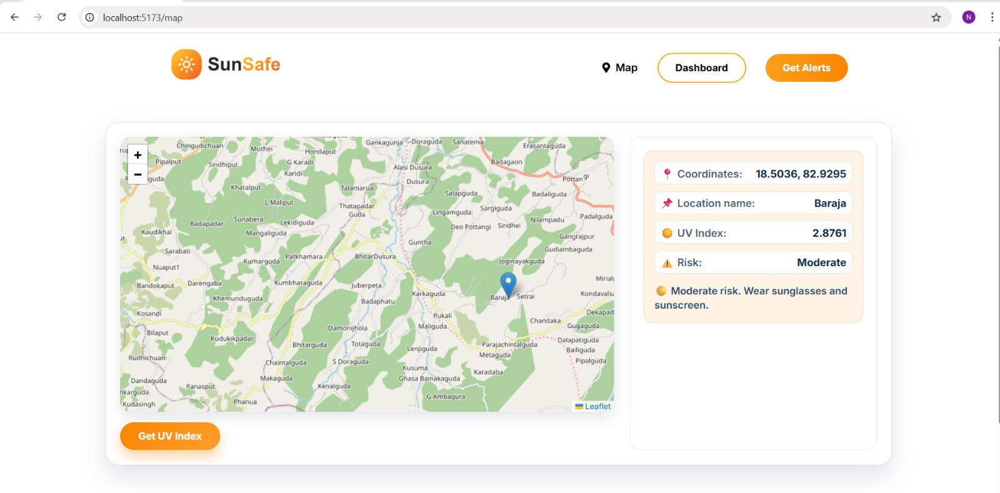
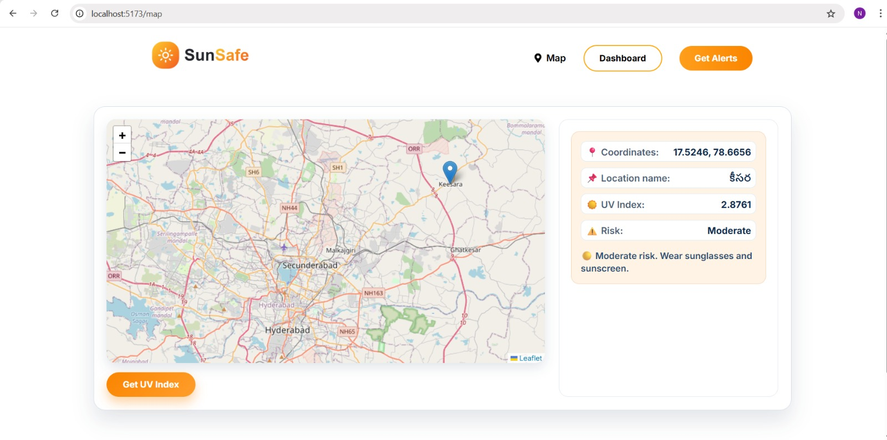
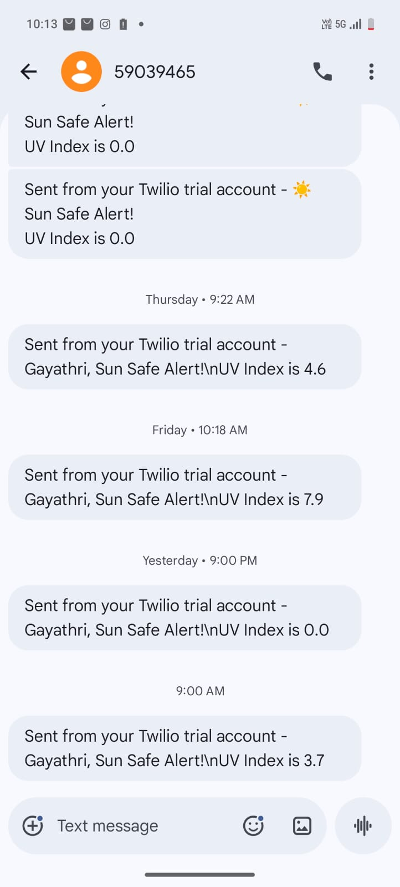

# SunSafe — UV Alert Notification System

SunSafe is a full-stack UV alert notification system that monitors ultraviolet radiation levels based on user location and sends alerts when UV exposure exceeds user-defined thresholds.

The system is designed to optimize API usage by grouping nearby users by location, caching UV values, and applying cooldown logic to prevent repeated notifications.

---

## Project Overview

SunSafe allows users to:

* Register with name, phone number, and location
* Set a personal UV threshold
* Choose alert frequency
* Enable peak UV hour alerts
* Receive SMS notifications when UV index exceeds threshold

The backend periodically checks UV levels using scheduled cron jobs and sends notifications only when required.

---

## Core Features

* User subscription with geolocation
* UV threshold customization
* SMS notification system
* UV monitoring using scheduled cron jobs
* Location-based grouping to reduce external API calls
* MongoDB caching of UV data
* Cooldown control to avoid duplicate alerts

---

## Technology Stack

### Frontend

* React
* Axios
* CSS

### Backend

* Node.js
* Express.js
* MongoDB
* Mongoose
* node-cron

### External Services

* OpenUV API
* Twilio SMS API

---

## System Architecture

```text
Frontend → Express API → MongoDB
                    ↓
               Cron Scheduler
                    ↓
               OpenUV Service
                    ↓
               SMS Notification
```

---

## Project Screenshots

### Home Page


### Dashboard


### Alerts


### Map View





### SMS Alerts


---

## Folder Structure

```text
SunSafe/
├── frontend/
│   ├── src/
│   └── public/
│
├── backend/
│   ├── config/
│   ├── cron/
│   ├── models/
│   ├── routes/
│   ├── services/
│   └── server.js
```

---


## Installation

### Clone Repository

```bash
git clone https://github.com/nivyaalikanti/Sun-Safe.git
```

---

## Backend Setup

```bash
cd backend
npm install
npm start
```

---

## Frontend Setup

```bash
cd frontend
npm install
npm run dev
```

---

## Environment Variables

Create `backend/.env`

```env
PORT=5000
MONGO_URI=your_mongodb_connection
OPENUV_API_KEY=your_openuv_key
TWILIO_ACCOUNT_SID=your_twilio_sid
TWILIO_AUTH_TOKEN=your_twilio_token
TWILIO_PHONE_NUMBER=your_twilio_number
```

---

## API Endpoints

### Subscribe User

```http
POST /api/subscribe
```

### UV Monitoring

```http
GET /api/uv
```

---

## Current Notification Logic

SMS notifications are triggered only when:

* UV index >= user threshold
* User is active
* Cooldown condition is satisfied

---

## Future Improvements

* Email notification support
* Duplicate user prevention
* Real-time alert dashboard
* Historical UV analytics
* Weather integration

---

## Author

Nivya
